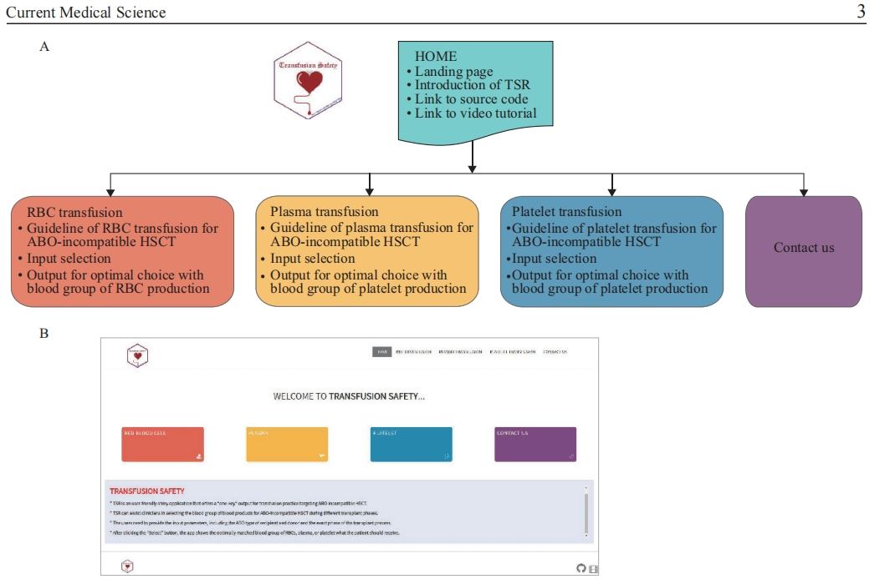

# TSR
TSR is an easy-to-use application that offers a “one-key” output for transfusion practice targeting ABO-incompatible HSCT. 
The benefit of TSR is that the physician can review each ABO-incompatible HSCT case before receiving the blood products and individualize the transfusion therapy. 
